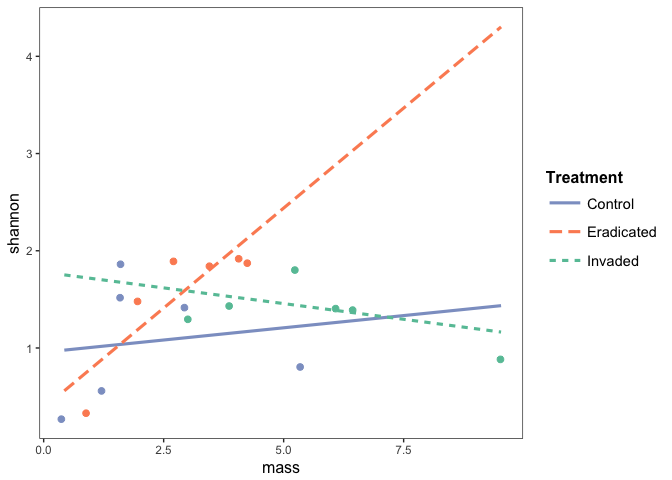

Results & Analyses for Earthworm MS by MRJ
================
Michelle R. Jackson
4/28/2018

\`\`\` **Figure 1/ANOVA table 1- looking at treatment effects on earthworms**

``` r
#read csv file
#NOTE: you have to set the working directory from within Rstudio
env<-read.csv('gm_ew_totals.csv',header=TRUE)
#display the beginning of the .csv file
head(env)
```

    ##   site Treatment replicate  gm   ew moisture soil   ph carbon nitrogen
    ## 1   HF   Invaded         1  14 3.01     0.20 16.1 4.67   6.57     4.47
    ## 2   HF   Invaded         2   0 3.78     0.00 16.6 4.75  14.27     0.91
    ## 3   HF   Invaded         3   4 6.14     0.35 16.1 5.05   7.42     2.60
    ## 4   MC   Invaded         1 107 6.37     0.33 19.6 5.31   8.64     3.39
    ## 5   MC   Invaded         2  43 5.29     0.62 19.9 4.74   5.21     1.92
    ## 6   MC   Invaded         3  26 9.53     0.75 19.6 5.16   6.99     0.47
    ##   cover
    ## 1     4
    ## 2     0
    ## 3     4
    ## 4     5
    ## 5     5
    ## 6     4

``` r
#looking at earthworm biomass as a factor of treatment & site
ewmodel1<-aov(ew~site+Treatment, data=env)
#install 'car' package to perform type II ANOVAs https://cran.r-project.org/web/packages/car/index.html
library(car)
```

    ## Loading required package: carData

``` r
#run type II ANOVA -- treatment has a significant effect on earthworm biomass p=0.01532
Anova(ewmodel1, type="II")
```

    ## Anova Table (Type II tests)
    ## 
    ## Response: ew
    ##           Sum Sq Df F value  Pr(>F)  
    ## site       1.056  1  0.2938 0.59630  
    ## Treatment 41.090  2  5.7160 0.01532 *
    ## Residuals 50.320 14                  
    ## ---
    ## Signif. codes:  0 '***' 0.001 '**' 0.01 '*' 0.05 '.' 0.1 ' ' 1

``` r
#look at the variance inflation factors of the model 
vif(ewmodel1)
```

    ##           GVIF Df GVIF^(1/(2*Df))
    ## site         1  1               1
    ## Treatment    1  2               1

``` r
#Tukey test on Treatment - invaded is different than control/marginally significantly different than eradicated
TukeyHSD(ewmodel1)
```

    ##   Tukey multiple comparisons of means
    ##     95% family-wise confidence level
    ## 
    ## Fit: aov(formula = ew ~ site + Treatment, data = env)
    ## 
    ## $site
    ##            diff       lwr      upr    p adj
    ## MC-HF 0.4844444 -1.432388 2.401277 0.596303
    ## 
    ## $Treatment
    ##                         diff         lwr      upr     p adj
    ## Eradicated-Control 0.7033333 -2.16147775 3.568144 0.7994735
    ## Invaded-Control    3.4983333  0.63352225 6.363144 0.0166886
    ## Invaded-Eradicated 2.7950000 -0.06981108 5.659811 0.0562408

``` r
#install 'effects' package to look at treatment effects https://cran.r-project.org/web/packages/effects/index.html
library(effects) 
```

    ## lattice theme set by effectsTheme()
    ## See ?effectsTheme for details.

``` r
#plot effects of the model
plot(allEffects(ewmodel1)) 
```


``` r
#run 'agricolae' package to get additional information for tukey tests https://cran.r-project.org/web/packages/agricolae/index.html
library(agricolae)
(HSD.test(ewmodel1, "Treatment"))
```

    ## $statistics
    ##    MSerror Df     Mean       CV      MSD
    ##   3.594287 14 3.588889 52.82583 2.864811
    ## 
    ## $parameters
    ##    test    name.t ntr StudentizedRange alpha
    ##   Tukey Treatment   3         3.701394  0.05
    ## 
    ## $means
    ##                  ew      std r  Min  Max    Q25   Q50    Q75
    ## Control    2.188333 1.802192 6 0.43 5.44 1.2225 1.575 2.6475
    ## Eradicated 2.891667 1.321793 6 0.80 4.34 2.2225 3.070 3.8650
    ## Invaded    5.686667 2.297866 6 3.01 9.53 4.1575 5.715 6.3125
    ## 
    ## $comparison
    ## NULL
    ## 
    ## $groups
    ##                  ew groups
    ## Invaded    5.686667      a
    ## Eradicated 2.891667     ab
    ## Control    2.188333      b
    ## 
    ## attr(,"class")
    ## [1] "group"

``` r
#run 'multcomp' package to get additional information for tukey tests https://cran.r-project.org/web/packages/multcomp/index.html
library(multcomp)
```

    ## Loading required package: mvtnorm

    ## Loading required package: survival

    ## Loading required package: TH.data

    ## Loading required package: MASS

    ## 
    ## Attaching package: 'TH.data'

    ## The following object is masked from 'package:MASS':
    ## 
    ##     geyser

``` r
mc = glht(ewmodel1,
          mcp(Treatment = "Tukey"))
summary(mc)
```

    ## 
    ##   Simultaneous Tests for General Linear Hypotheses
    ## 
    ## Multiple Comparisons of Means: Tukey Contrasts
    ## 
    ## 
    ## Fit: aov(formula = ew ~ site + Treatment, data = env)
    ## 
    ## Linear Hypotheses:
    ##                           Estimate Std. Error t value Pr(>|t|)  
    ## Eradicated - Control == 0   0.7033     1.0946   0.643   0.7994  
    ## Invaded - Control == 0      3.4983     1.0946   3.196   0.0166 *
    ## Invaded - Eradicated == 0   2.7950     1.0946   2.554   0.0561 .
    ## ---
    ## Signif. codes:  0 '***' 0.001 '**' 0.01 '*' 0.05 '.' 0.1 ' ' 1
    ## (Adjusted p values reported -- single-step method)

``` r
#run 'visreg' package to visualize regression https://cran.r-project.org/web/packages/visreg/index.html
library(visreg)
visreg(ewmodel1)
```


``` r
summary(visreg(ewmodel1))
```


    ##      Length Class  Mode
    ## [1,] 3      visreg list
    ## [2,] 3      visreg list

``` r
#run 'margins' package to calculate marginal or patial effects of the model https://cran.r-project.org/web/packages/margins/index.html
library(margins)
margins(ewmodel1)
```

    ## Average marginal effects

    ## aov(formula = ew ~ site + Treatment, data = env)

    ##  siteMC TreatmentEradicated TreatmentInvaded
    ##  0.4844              0.7033            3.498

``` r
plot(margins(ewmodel1))
```


``` r
#run 'emmeans' package for least-squares means of the model - previously lsmeans package, but that's being phased out of R https://cran.r-project.org/web/packages/emmeans/vignettes/transition-from-lsmeans.html
library(emmeans)
#run 'ggplot2' package to create figure of the model https://cran.r-project.org/web/packages/ggplot2/README.html
library(ggplot2)
#calculate emmeans of the treatment of the model 
emmeans(ewmodel1,"Treatment")
```

    ##  Treatment    emmean        SE df  lower.CL upper.CL
    ##  Control    2.188333 0.7739818 14 0.5283076 3.848359
    ##  Eradicated 2.891667 0.7739818 14 1.2316409 4.551692
    ##  Invaded    5.686667 0.7739818 14 4.0266409 7.346692
    ## 
    ## Results are averaged over the levels of: site 
    ## Confidence level used: 0.95

``` r
#create data frame for the model fitted with emmeans
fig1<-summary(emmeans(ewmodel1,"Treatment"))
fig1
```

    ##  Treatment    emmean        SE df  lower.CL upper.CL
    ##  Control    2.188333 0.7739818 14 0.5283076 3.848359
    ##  Eradicated 2.891667 0.7739818 14 1.2316409 4.551692
    ##  Invaded    5.686667 0.7739818 14 4.0266409 7.346692
    ## 
    ## Results are averaged over the levels of: site 
    ## Confidence level used: 0.95

``` r
names(fig1)
```

    ## [1] "Treatment" "emmean"    "SE"        "df"        "lower.CL"  "upper.CL"

``` r
#Data frame for the figure with code for ggplot parameters 
myfig1<-transform(fig1,Treatment=reorder(Treatment,-emmean))
ggplot(myfig1,aes(x = Treatment, y = emmean)) + 
  geom_bar(position=position_dodge(), stat="identity") +
  geom_errorbar(aes(ymax=emmean+SE, ymin=emmean-SE),
                width=0.1, size=0.5, color="black", position=position_dodge(.9))+  labs(x = "Treatment",
                                                                                       y = "Earthworm Biomass (g)")  +
  theme_bw()+
  theme(axis.text = element_text(size=12,colour = "black"))+
  theme(axis.title.x = element_text(size=12,face="bold")) +
  theme(axis.title.y = element_text(size=12,face="bold")) +
  theme(legend.title = element_text(size=12, face="bold"))+
  theme(legend.text = element_text(size = 12))+
  scale_y_continuous(expand = c(0,0)) +
  expand_limits(y=7) +
  theme(legend.position = "none")+
  theme(panel.border = element_blank(), panel.grid.major = element_blank(), panel.grid.minor = element_blank(),axis.line = element_line(colour = "black"))
```


``` r
#Test of effects of Treatment on environmental variables**
head(env)
```

    ##   site Treatment replicate  gm   ew moisture soil   ph carbon nitrogen
    ## 1   HF   Invaded         1  14 3.01     0.20 16.1 4.67   6.57     4.47
    ## 2   HF   Invaded         2   0 3.78     0.00 16.6 4.75  14.27     0.91
    ## 3   HF   Invaded         3   4 6.14     0.35 16.1 5.05   7.42     2.60
    ## 4   MC   Invaded         1 107 6.37     0.33 19.6 5.31   8.64     3.39
    ## 5   MC   Invaded         2  43 5.29     0.62 19.9 4.74   5.21     1.92
    ## 6   MC   Invaded         3  26 9.53     0.75 19.6 5.16   6.99     0.47
    ##   cover
    ## 1     4
    ## 2     0
    ## 3     4
    ## 4     5
    ## 5     5
    ## 6     4

``` r
#ANOVA of pH as a factor of treatment with site accounted for
PHtest<-aov(ph~Treatment+site,data=env)
#summary of aforementioned ANOVA
summary(PHtest)
```

    ##             Df Sum Sq Mean Sq F value Pr(>F)  
    ## Treatment    2 0.2659 0.13294   3.626 0.0539 .
    ## site         1 0.2568 0.25681   7.004 0.0192 *
    ## Residuals   14 0.5133 0.03667                 
    ## ---
    ## Signif. codes:  0 '***' 0.001 '**' 0.01 '*' 0.05 '.' 0.1 ' ' 1

``` r
#plot the effects of the ANOVA
plot(allEffects(PHtest))
```


``` r
#ANOVA of N as a factor of treatment with site accounted for
Ntrest<-aov(nitrogen~Treatment+site,data=env)
#summary of N ANOVA
summary(Ntrest)
```

    ##             Df Sum Sq Mean Sq F value Pr(>F)
    ## Treatment    2   0.36   0.179   0.075  0.928
    ## site         1   7.30   7.296   3.078  0.101
    ## Residuals   14  33.19   2.371

``` r
#ANOVA of plot moisture as a factor of treatment with site accounted for
moisturetest<-aov(moisture~Treatment+site,data=env)
#summary of moisture ANOVA
summary(moisturetest)
```

    ##             Df Sum Sq Mean Sq F value Pr(>F)
    ## Treatment    2 0.1310 0.06552   0.509  0.612
    ## site         1 0.0578 0.05780   0.449  0.514
    ## Residuals   14 1.8008 0.12863

``` r
#looking at stem counts
#read in csv file
stemcounts<-read.csv('ew_ms_native_plant_spp.csv',header=TRUE)
```

    ## Warning in file(file, "rt"): cannot open file 'ew_ms_native_plant_spp.csv':
    ## No such file or directory

    ## Error in file(file, "rt"): cannot open the connection

``` r
#ANOVA of stem counts as a factor of site with treatment accounted for 
stemeffects<-aov(stem~site+Treatment,data=stemcounts)
```

    ## Error in terms.formula(formula, "Error", data = data): object 'stemcounts' not found

``` r
#summary of stem counts
summary(stemeffects)
```

    ## Error in summary(stemeffects): object 'stemeffects' not found

**Figure 2/ANOVA table 1- looking at treatment effects on earthworms**

``` r
#read in csv file
allvariables<-read.csv('garlicMustardEarthworm_15March_2018.csv',header=TRUE)
#show head of data frame
head(allvariables)
```

    ##   X          plotID year site  Treatment replicate acerru acersa actapa
    ## 1 1 2017-Spr-HF-I-1 2017   HF    Invaded         1      0     12      0
    ## 2 2 2017-Spr-HF-I-2 2017   HF    Invaded         2      1      5      0
    ## 3 3 2017-Spr-HF-I-3 2017   HF    Invaded         3      0      8      0
    ## 4 4 2017-Spr-HF-P-1 2017   HF Eradicated         1      1      6      0
    ## 5 5 2017-Spr-HF-P-2 2017   HF Eradicated         2      0      6      0
    ## 6 6 2017-Spr-HF-P-3 2017   HF Eradicated         3      0      5      0
    ##   allipe_1 allipe_2 allipe_total aristr betual careap carela caresp carpca
    ## 1       14        0           14      0      0      0      0      0      0
    ## 2        0        0            0     12      0      0      0      0      0
    ## 3        4        0            4      2      0      0      0      0      0
    ## 4       13        0           13      0      0      0      0      0      0
    ## 5        0        0            0      5      0      0      0      0      0
    ## 6        4        0            4      4      0      0      0      0      1
    ##   caryco dennpu dryoca erytam eurydi fraxam galitr impaca maiaca maiara
    ## 1      0      0      0      0      0      0      0      0     14     15
    ## 2      0      0      0      0      0      0      0      0      0      8
    ## 3      0      0      0      0     11      1      0      0      0      1
    ## 4      0      0      0      0      0      0      0      0    137      0
    ## 5      0      0      0      0      0      0      0      0     18      1
    ## 6      0      0      0      0      2      2      0      0      0      1
    ##   onocse ostrvi partqu polyac polybi prunse prunse_cot querru ranuab
    ## 1      0      0      0      0      0     27          0      0      0
    ## 2      0      0      0      0      0     14          0      2      0
    ## 3      0      0      0      0      0     18          0      0      0
    ## 4      0      0      0      0      1      6          0      0      0
    ## 5      0      0      0      0      0      6          0      3      0
    ## 6      0      0      0      0      2      9          0      0      0
    ##   rubual solicae toxira violsp   shannon totalStem mass Fern Forb Grass
    ## 1      0       0      0      0 1.3316543  69.33165 3.01    0   29     0
    ## 2      0       0      0      0 1.5273196  43.52732 3.78    0   20     0
    ## 3      0       0      0      0 1.3617339  42.36173 6.14    0   14     0
    ## 4      0       0      0      0 0.4110646 151.41106 0.80    0  138     0
    ## 5      0       0      0      0 1.4873865  40.48739 2.05    0   24     0
    ## 6      0       0      0      1 1.9059750  28.90597 4.34    0   10     0
    ##   NonNative Woody
    ## 1        29    39
    ## 2         2    22
    ## 3         9    27
    ## 4        31    13
    ## 5         1    15
    ## 6         9    17

``` r
#test of fit with shannon diversity as a factor of earthworm biomass,treatment & site
shandiv<-lm(shannon~mass+site+Treatment,data=allvariables)
#type II ANOVA of this fit
Anova(shandiv, type="II")
```

    ## Anova Table (Type II tests)
    ## 
    ## Response: shannon
    ##           Sum Sq Df F value Pr(>F)
    ## mass      0.1365  1  0.4458 0.5160
    ## site      0.0028  1  0.0093 0.9248
    ## Treatment 0.6797  2  1.1101 0.3588
    ## Residuals 3.9797 13

``` r
#summary of ANOVA
summary(shandiv)
```

    ## 
    ## Call:
    ## lm(formula = shannon ~ mass + site + Treatment, data = allvariables)
    ## 
    ## Residuals:
    ##     Min      1Q  Median      3Q     Max 
    ## -1.0646 -0.2973  0.1239  0.2769  0.8068 
    ## 
    ## Coefficients:
    ##                     Estimate Std. Error t value Pr(>|t|)   
    ## (Intercept)          0.96502    0.30178   3.198    0.007 **
    ## mass                 0.05208    0.07800   0.668    0.516   
    ## siteMC              -0.02536    0.26355  -0.096    0.925   
    ## TreatmentEradicated  0.46897    0.32412   1.447    0.172   
    ## TreatmentInvaded     0.16377    0.42012   0.390    0.703   
    ## ---
    ## Signif. codes:  0 '***' 0.001 '**' 0.01 '*' 0.05 '.' 0.1 ' ' 1
    ## 
    ## Residual standard error: 0.5533 on 13 degrees of freedom
    ## Multiple R-squared:  0.1908, Adjusted R-squared:  -0.05825 
    ## F-statistic: 0.7661 on 4 and 13 DF,  p-value: 0.5659

``` r
#new test of fit with shannon diversity as a factor of an interaction between earthworm biomass*treatment and site
shandiv2<-lm(shannon~site+Treatment*mass, data=allvariables)
#type II ANOVA of new fit
Anova(shandiv2, type="II")
```

    ## Anova Table (Type II tests)
    ## 
    ## Response: shannon
    ##                 Sum Sq Df F value  Pr(>F)  
    ## site           0.00419  1  0.0185 0.89426  
    ## Treatment      0.67968  2  1.4993 0.26559  
    ## mass           0.13648  1  0.6021 0.45414  
    ## Treatment:mass 1.48635  2  3.2786 0.07641 .
    ## Residuals      2.49339 11                  
    ## ---
    ## Signif. codes:  0 '***' 0.001 '**' 0.01 '*' 0.05 '.' 0.1 ' ' 1

``` r
#summary of ANOVA
summary(shandiv2)
```

    ## 
    ## Call:
    ## lm(formula = shannon ~ site + Treatment * mass, data = allvariables)
    ## 
    ## Residuals:
    ##      Min       1Q   Median       3Q      Max 
    ## -0.71573 -0.27875 -0.03379  0.26066  0.79924 
    ## 
    ## Coefficients:
    ##                          Estimate Std. Error t value Pr(>|t|)  
    ## (Intercept)               0.97539    0.42157   2.314    0.041 *
    ## siteMC                   -0.03819    0.28079  -0.136    0.894  
    ## TreatmentEradicated      -0.57385    0.65665  -0.874    0.401  
    ## TreatmentInvaded          0.82345    0.75118   1.096    0.296  
    ## mass                      0.05027    0.13223   0.380    0.711  
    ## TreatmentEradicated:mass  0.36107    0.22668   1.593    0.139  
    ## TreatmentInvaded:mass    -0.11489    0.18226  -0.630    0.541  
    ## ---
    ## Signif. codes:  0 '***' 0.001 '**' 0.01 '*' 0.05 '.' 0.1 ' ' 1
    ## 
    ## Residual standard error: 0.4761 on 11 degrees of freedom
    ## Multiple R-squared:  0.493,  Adjusted R-squared:  0.2164 
    ## F-statistic: 1.783 on 6 and 11 DF,  p-value: 0.1922

``` r
#plot the effects of this new model fit
plot(allEffects(shandiv2))
```


``` r
#install 'jtools' package https://cran.r-project.org/web/packages/jtools/index.html
library(jtools)
#summary of the model reported
summ(shandiv2)
```

    ## MODEL INFO:
    ## Observations: 18
    ## Dependent Variable: shannon
    ## 
    ## MODEL FIT: 
    ## F(6,11) = 1.78, p = 0.19
    ## R-squared = 0.49
    ## Adj. R-squared = 0.22
    ## 
    ## Standard errors: OLS 
    ##                           Est. S.E. t val.    p  
    ## (Intercept)               0.98 0.42   2.31 0.04 *
    ## siteMC                   -0.04 0.28  -0.14 0.89  
    ## TreatmentEradicated      -0.57 0.66  -0.87 0.4   
    ## TreatmentInvaded          0.82 0.75   1.1  0.3   
    ## mass                      0.05 0.13   0.38 0.71  
    ## TreatmentEradicated:mass  0.36 0.23   1.59 0.14  
    ## TreatmentInvaded:mass    -0.11 0.18  -0.63 0.54

``` r
summ(shandiv2, scale = TRUE)
```

    ## MODEL INFO:
    ## Observations: 18
    ## Dependent Variable: shannon
    ## 
    ## MODEL FIT: 
    ## F(6,11) = 1.78, p = 0.19
    ## R-squared = 0.49
    ## Adj. R-squared = 0.22
    ## 
    ## Standard errors: OLS 
    ##                           Est. S.E. t val.    p   
    ## (Intercept)               1.16 0.26   4.42 0    **
    ## site                     -0.04 0.28  -0.14 0.89   
    ## TreatmentEradicated       0.72 0.36   2.01 0.07  .
    ## TreatmentInvaded          0.41 0.38   1.1  0.3    
    ## mass                      0.12 0.31   0.38 0.71   
    ## TreatmentEradicated:mass  0.84 0.53   1.59 0.14   
    ## TreatmentInvaded:mass    -0.27 0.43  -0.63 0.54   
    ## 
    ## All continuous predictors are mean-centered and scaled by 1 s.d.

``` r
#list of hex codes for colors associated with color-blind palette "cbPalette"
cbPalette <- c("#999999", "#E69F00", "#56B4E9", "#009E73", "#F0E442", "#0072B2", "#D55E00", "#CC79A7")
#command for interaction plot
interact_plot(shandiv2, pred = "mass", modx = "Treatment", plot.points = TRUE)
```



``` r
#revised model with 'eradicated' sites excluded
shandiv3<-lm(shannon~site+mass, data=allvariables[allvariables$Treatment=="Eradicated",])
#summary of the new model
summary(shandiv3)
```

    ## 
    ## Call:
    ## lm(formula = shannon ~ site + mass, data = allvariables[allvariables$Treatment == 
    ##     "Eradicated", ])
    ## 
    ## Residuals:
    ##        4        5        6       13       14       15 
    ## -0.27814  0.34494 -0.06681 -0.14375 -0.01619  0.15994 
    ## 
    ## Coefficients:
    ##             Estimate Std. Error t value Pr(>|t|)  
    ## (Intercept)   0.3991     0.3044   1.311   0.2811  
    ## siteMC        0.2485     0.2571   0.967   0.4049  
    ## mass          0.3626     0.1065   3.404   0.0423 *
    ## ---
    ## Signif. codes:  0 '***' 0.001 '**' 0.01 '*' 0.05 '.' 0.1 ' ' 1
    ## 
    ## Residual standard error: 0.2871 on 3 degrees of freedom
    ## Multiple R-squared:  0.8592, Adjusted R-squared:  0.7653 
    ## F-statistic: 9.151 on 2 and 3 DF,  p-value: 0.05285

``` r
#interaction plot of the original model with code for ggplot parameters 
interact_plot(shandiv2, pred = "mass", modx ="Treatment", plot.points = TRUE, x.label = "Earthworm Biomass (g)", y.label = "Native Plant Diversity", legend.main = "Treatment") +
  theme(axis.text = element_text(size=12))+
  theme(axis.title.x = element_text(size=12,face="bold")) +
  theme(axis.title.y = element_text(size=12,face="bold")) +
  theme(legend.text = element_text(size = 12))+
  scale_colour_manual(values=cbPalette)
```

    ## Scale for 'colour' is already present. Adding another scale for
    ## 'colour', which will replace the existing scale.


